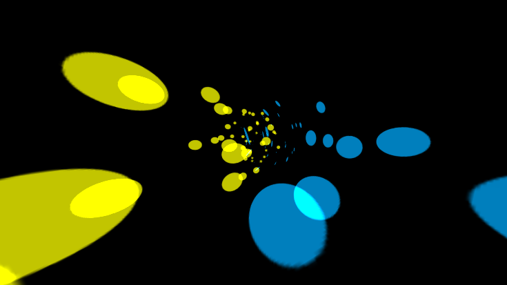
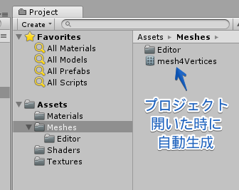
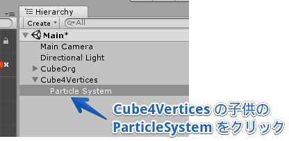
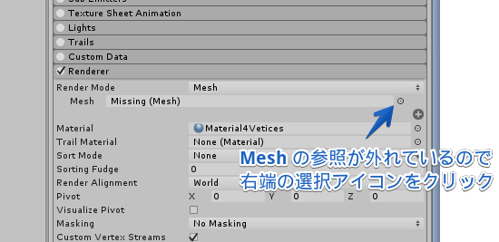
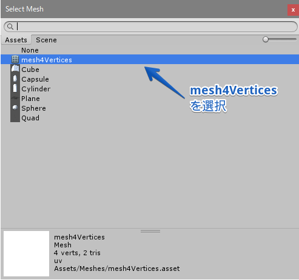

# ParticleSystemBeamShaderDemo

Unity の ParticleSystem 上で「射線軸から見ても破綻しないビーム」を実装した 2017.3 用のプロジェクトです。
動作デモを [unityroom](https://unityroom.com/games/particlesystembeamshaderdemo) で公開中です。

青いビームは ParticleSystem 内蔵の Streched Billboard、黄色いビームが今回の方法で描画しています。

描画方法の基本的なアイデアは Unite 2016 Tokyo の安原氏の講演「ハードウェア性能を引き出して60fpsを
実現するプログラミング・テクニック([PDF](http://japan.unity3d.com/unite/unite2016/files/DAY1_1700_room1_Yasuhara.pdf), [YouTube](https://youtu.be/VNVDtUT_4rs))」で
公開されたゲーム「[Another Thread](https://github.com/unity3d-jp/AnotherThread)」の「楕円シェーダー」に基づくものです。

[github](https://github.com/unity3d-jp/AnotherThread) ソースコード内の
- [AnotherThread/Assets/Scripts/Beam.cs](https://github.com/unity3d-jp/AnotherThread/blob/master/Assets/Shaders/beam.shader)
- [AnotherThread/Assets/Shaders/beam.shader](https://github.com/unity3d-jp/AnotherThread/blob/master/Assets/Scripts/Beam.cs)

の 2 つのファイルが楕円シェーダー関係のソースになります。

## プロジェクトの使い方

Particle の表示に使うメッシュはエディタ拡張によりプロジェクトを開いた時に自動生成します。
そのため、Unity でプロジェクトを開いた直後は、ParticleSystem の Mesh の参照が外れているため表示されません。
以下の手順で参照を設定する必要があります。
(これは最初の一度だけ必要な操作です。自動生成されたメッシュを削除しない限り何度も行う必要はありません)

1. まず、Assets/Meshes/ の下に mesh4Vertices が生成されている事を確認して下さい。

2. Hierarchy の Cube4Vertices の子供に ParticleSystem がありますのでクリックしてください。

3. Inspector に ParticleSystem のモジュールが多数表示されますが、最後の方にある Renderer をクリックし、
その中の Mesh 欄の参照が外れているので、右端の選択アイコンをクリックします。

4. メッシュ選択ダイアログから mesh4Vertices を選択します。

